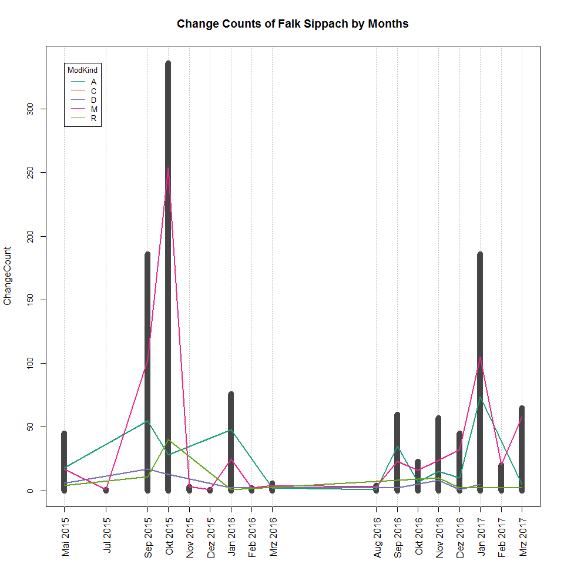
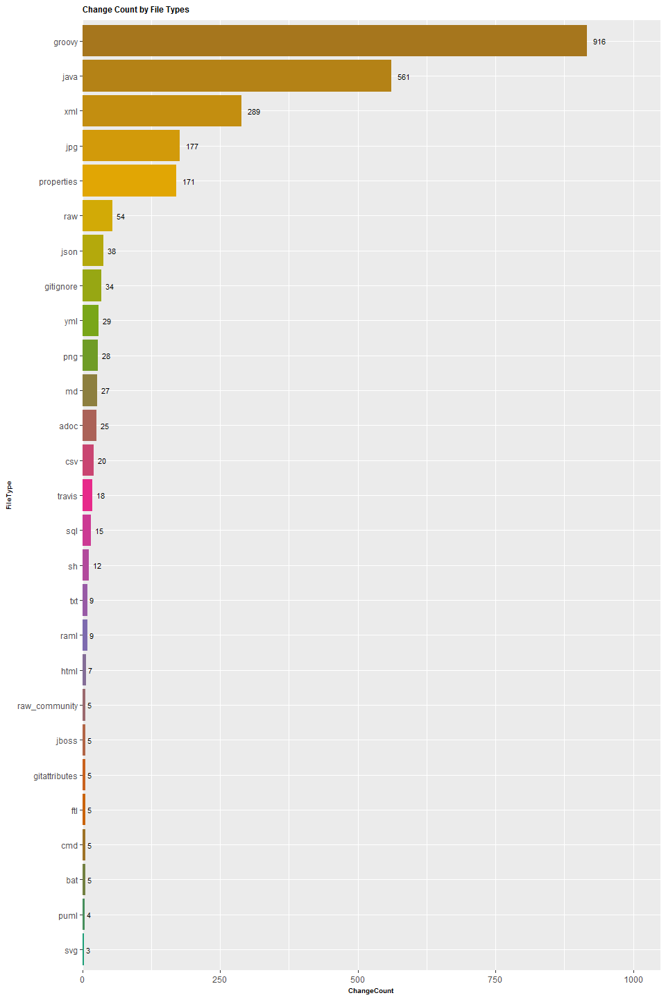
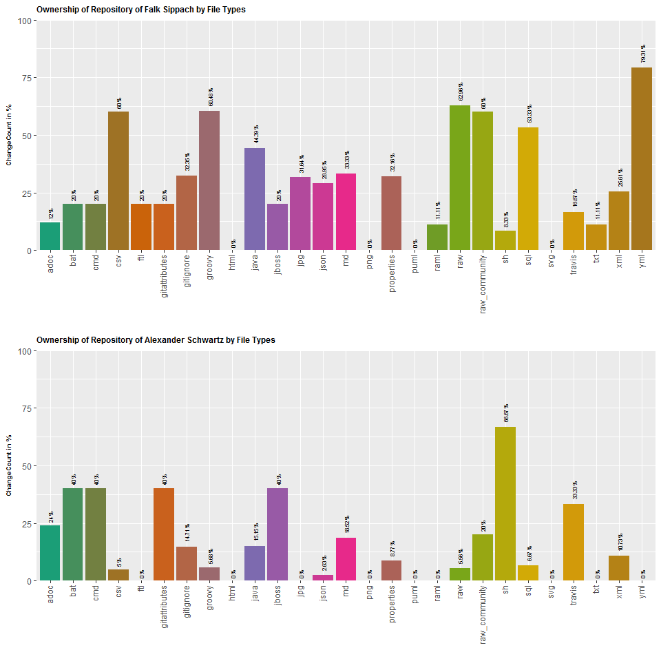
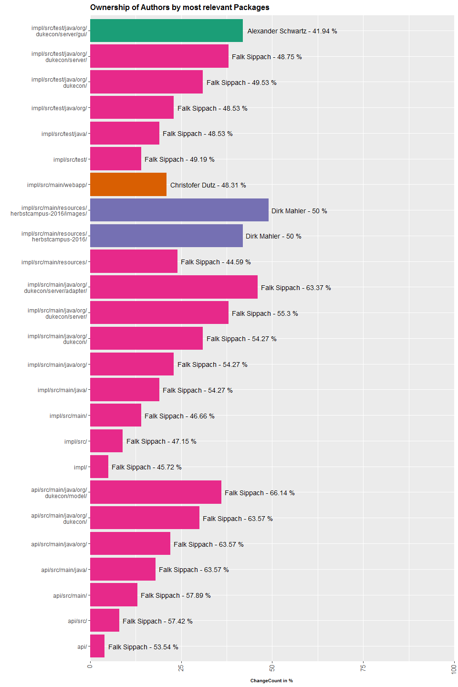
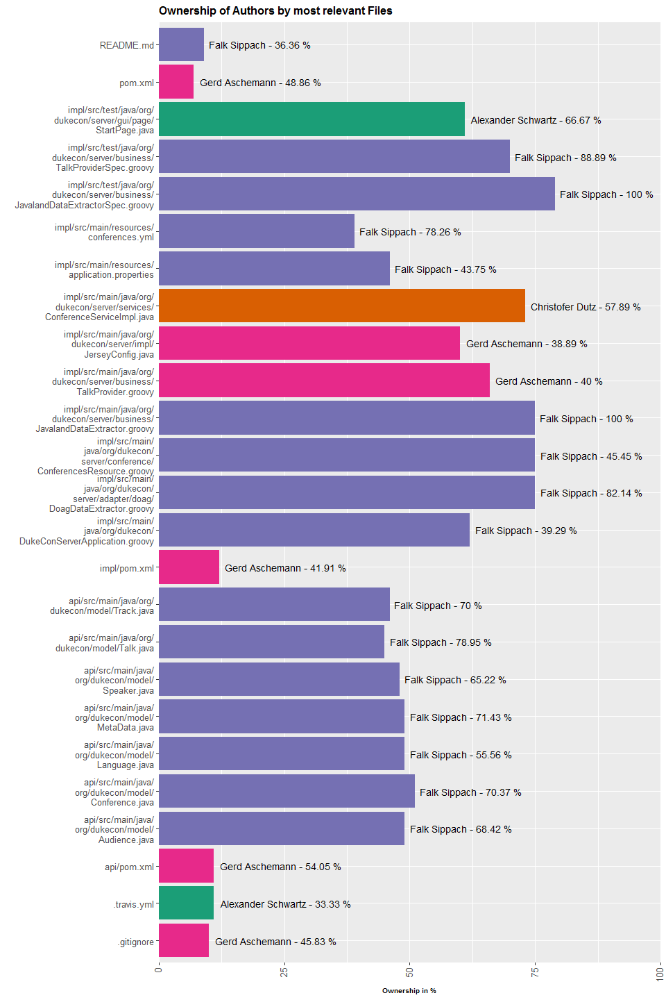
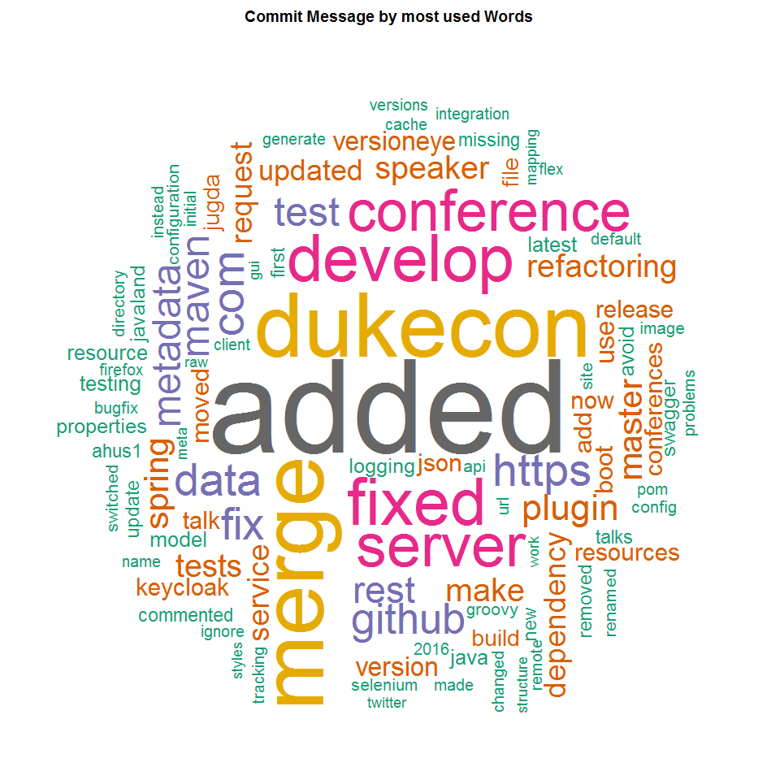

Git-Repository Analysis
================

-   [Introduction](#introduction)
    -   [Context](#context)
    -   [Authors](#authors)
    -   [Repository](#repository)
    -   [Topic](#topic)
    -   [Goal](#goal)
-   [Setup](#setup)
    -   [Tools](#tools)
    -   [Instructions](#instructions)
-   [Analysis](#analysis)
    -   [Changes in Repository](#changes-in-repository)
        -   [Change Count by Modification Kind](#change-count-by-modification-kind)
        -   [Change Count by Modification Kind and Authors](#change-count-by-modification-kind-and-authors)
    -   [Changes by Time](#changes-by-time)
        -   [Change Count by Month](#change-count-by-month)
        -   [Change Count by Month and Authors](#change-count-by-month-and-authors)
    -   [Changes by File Type](#changes-by-file-type)
        -   [Change Count by File Type](#change-count-by-file-type)
        -   [Change Count by File Type and Authors](#change-count-by-file-type-and-authors)
    -   [Ownership of Repository](#ownership-of-repository)
        -   [Ownership of Repository by File Types and Authors](#ownership-of-repository-by-file-types-and-authors)
        -   [Ownership of Repository by Packages](#ownership-of-repository-by-packages)
        -   [Ownership of Repository by Files](#ownership-of-repository-by-files)
    -   [Most used Words](#most-used-words)
        -   [Word Cloud of Repository](#word-cloud-of-repository)
        -   [Word Cloud of Repository by File Type](#word-cloud-of-repository-by-file-type)
        -   [Word Cloud of Repository by Author](#word-cloud-of-repository-by-author)
-   [Conclusion](#conclusion)

Introduction
------------

### Context

-   Knowledge Management | Project Paper

### Authors

-   [70415245 | Lisa Rosenberg](https://github.com/lisa-rosenberg)
-   [70428153 | Dmitrij Drandarov](https://github.com/dmitrij-drandarov)

### Repository

-   [dukecon-server](https://github.com/DirkMahler/dukecon_server)

### Topic

In dieser Arbeit befassen wir uns mit der Analyse eines beispielhaften Git-Repositories.

Konkret handelt es sich um ein Repository für ein Konferenz-Tool, mit dem Besuchern die Möglichkeit gegeben wird, Veranstaltungen anzusehen und sich diese vormerken zu können. Wir haben uns für dieses Repository entschieden, da es sich vom Umfang her gut für das Projekt eignet und wir die Anwendung und einige der beteiligten Autoren persönlich kennen.

### Goal

Ziel ist es, einen Überblick über das Git-Repository zu erhalten und mit den gewonnenen Erkenntnissen mehr über dessen Struktur und Verlauf aussagen zu können. Beispielsweise suchen wir Indizien, die auf die Qualität des Projektes schließen und mögliche Probleme andeuten.

Setup
-----

Um ein Git-Repository untersuchen zu können, werden bestimmte Tools benötigt. Im Folgenden werden diese benannt und deren Nutzung beschrieben, um Daten aus dem Git-Repository abfragen zu können.

### Tools

-   [Neo4j](https://neo4j.com/)
-   [jQAssistant](https://github.com/buschmais/jqassistant)
-   [jQAssistant Git-Plugin](https://github.com/kontext-e/jqassistant-plugins/blob/master/git/src/main/asciidoc/git.adoc)

### Instructions

-   Zuerst muss das jQAssistant-Plugin in die pom.xml eines Maven-Projekts hinzugefügt werden:

``` xml
<build>
    <plugins>
        <plugin>
            <groupId>com.buschmais.jqassistant</groupId>
            <artifactId>jqassistant-maven-plugin</artifactId>
            <version>${jqassistant-maven-plugin.version}</version>
            <extensions>true</extensions>
            <executions>
                <execution>
                    <goals>
                        <goal>scan</goal>
                        <goal>analyze</goal>
                    </goals>
                    <configuration>
                        <scanIncludes>
                            <scanInclude>
                                <path>${project.basedir}/.git</path>
                            </scanInclude>
                        </scanIncludes>
                    </configuration>
                </execution>
            </executions>
            <dependencies>
                <dependency>
                    <groupId>de.kontext-e.jqassistant.plugin</groupId>
                    <artifactId>jqassistant.plugin.git</artifactId>
                    <version>1.2.0</version>
                </dependency>
            </dependencies>
        </plugin>
    </plugins>
</build>
```

-   Hiernach müssen folgende Maven-Befehle aufgerufen werden, um den lokalen Neo4j-Server zu starten:

<!-- -->

    mvn install
    mvn jqassistant:server

-   Über die Adresse <http://localhost:7474> erfolgt der Zugriff auf die lokale Neo4j-Datenbank

-   Nun können in der oberen Zeile Cypher-Queries eingegeben werden. Die Ergebnisse lassen sich als csv-Dateien exportieren und z.B. mit R analysieren

Analysis
--------

Git kodiert verschiedene Modifikationstypen von Änderungen an Dateien als Buchstaben. Hier sieht man eine Auflistung aller möglichen Werte mit ihrer jeweiligen Bedeutung.

-   A → Added
-   C → Copied
-   D → Deleted
-   M → Modified
-   R → Renamed
-   T → Have their type (mode) changed
-   U → Unmerged
-   X → Unknown
-   B → Have had their pairing broken

### Changes in Repository

#### Change Count by Modification Kind

Zuerst verschaffen wir uns einen allgemeinen Überblick über das Repository. Dafür bietet es sich an, das Vorkommen aller Änderung im Verhältnis zueinander zu visualisieren.

-   Cypher-Query:

``` java
MATCH (author:Author)-[COMMITED]->(commit:Commit)-[CONTAINS_CHANGE]->(change:Change)-[MODIFIES]->(file:File)
RETURN change.modificationKind AS ModificationKind, count(change.modificationKind) AS ChangeCount
  ORDER BY ChangeCount DESC
```

-   R-Code:

``` r
# # Load data
csv <- read.table(file.path("../../result/dukecon/Change-Count.csv"), sep=",", header=TRUE)

# # Setup plot
slices <- c(csv$ChangeCount)
percentage <- round(slices/sum(slices)*100)
labels <- csv$ModificationKind
labels <- paste(labels, " (", slices, " | ", percentage, "%)", sep="")
colors <- brewer.pal(max(as.numeric(csv$ModificationKind)), palette)

# # Display plot
pie(slices, labels=labels, col=colors, main="Change Count by Modification Kind")
```


Man sieht, dass das Repository hauptsächlich modifiziert (M) wurde und auch vieles (wahrscheinlich am Anfang) zum Repository hinzugekommen ist (A). Das Repository hat aber nur sehr wenige gelöschte (D) oder kopierte Elemente (C) erlebt. Das deutet darauf hin, dass nicht viel "copy-pasted" wurde und es auch nicht an einer bestimmten Stelle im Projekte zu einem kompletten Neubau von Applikationsteile kam, bei dem man viel Code verworfen hat. Somit könnte man das geringe Vorkommen von (D) und (C) als Qualitätsmerkmale interpretieren.

#### Change Count by Modification Kind and Authors

Um weitere Informationen aus den Änderungstypen zu ziehen, betrachten wir, welche Personen für welche Änderungstypen hauptsächlich verantwortlich sind.

Damit die Visualisierung übersichtlich bleibt, werden nur die Autoren in dem Graphen berücksichtigt, die einen bestimmten Mindestanteil am gesamten Repository beigetragen haben.

-   Cypher-Query:

``` java
MATCH (author:Author)-[COMMITED]->(commit:Commit)-[CONTAINS_CHANGE]->(change:Change)-[MODIFIES]->(file:File)
RETURN author.name AS Author, change.modificationKind AS ModificationKind
    ORDER BY ModificationKind, Author
```

-   R-Code:

``` r
# # Load data
csv <- read.table(file.path("../../result/dukecon/wip/Change-Count-by-Author.csv"), sep=",", header=TRUE)

# # Filter data
percentage <- nrow(csv)/100
table <- table(csv$Author, csv$ModificationKind)
subset <- table[table(csv$Author)>percentage,]

# # Setup plot
colors <- brewer.pal(max(as.numeric(csv$ModificationKind)), palette)

# # Display plot
mosaicplot(subset, col=colors, las=3, ylab="ModificationKind", main="Change Count by Modification Kind and Authors", cex.axis=0.8, mar=c(0,0,0,0))
```


Man kann erkennen, dass Dirk Mahler hauptsächlich Dateien hinzugefügt und kaum welche verändert hat, wohingegen z.B. Christopher Dutz sehr viel modifiziert hat.

Das lässt darauf schließen, dass Dirk Mahler ggf. für das Hinzufügen von Applikationsteilen verantwortlich war, aber nicht an der Maintenance beteiligt ist. Außerdem fällt auch auf, dass der Entwickler mit der Kennung annam002 für viel Refactoring verantwortlich ist, da er einen großen Anteil an Renames (R) und Modifikationen (M) hat.

Die Breite der einzelnen Spalten gibt darüber hinaus Auskunft über die gesamte Anzahl der Änderungen des jeweiligen Autoren. Hier wird deutlich, dass Falk Sippach mit Abstand die meisten Änderungen am Repository beigetragen hat. Hiernach folgt Gerd Aschemann.

### Changes by Time

#### Change Count by Month

Um aus den Änderungstypen mehr relevante Informationen für das Repository erhalten zu können, setzen wir diese in zeitliche Relation. Dadurch erfährt man deutlich mehr über den Aufbau des Projektes. Es wird eine Art "Profil" erstellt.

-   Cypher-Query

``` java
MATCH (author:Author)-[COMMITED]->(commit:Commit)-[CONTAINS_CHANGE]->(change:Change)-[MODIFIES]->(file:File)
RETURN split(commit.date,'-')[0]+'-'+split(commit.date,'-')[1] AS CommitDate, change.modificationKind AS ModificationKind, count(change) AS ChangeCount
  ORDER BY ModificationKind, CommitDate, ChangeCount DESC
```

-   R-Code:

``` r
# # Load data
csv <- read.table(file.path("../../result/dukecon/wip/Change-Count-by-Date-Month.csv"), sep=",", header=TRUE)

# # Filter data
subset1 <- aggregate(ChangeCount ~ CommitDate, csv, sum)

# # Transform data
numModificationKind <- as.numeric(csv$ModificationKind) 
xrange <- range(as.yearmon(subset1$CommitDate))
yrange <- range(subset1$ChangeCount)

# # Setup plot
plot(xrange, yrange, type="n", xlab="", ylab="ChangeCount", main="Change Count by Month", cex.axis=0.8, mar=c(0,3.8,1.5,0), xaxt='n')
axis(side=1, las=2, labels=c(as.yearmon(csv$CommitDate)), at=c(as.yearmon(csv$CommitDate)))
abline(v=(c(as.yearmon(csv$CommitDate))), col="grey", lty="dotted")
colors <- brewer.pal(max(as.numeric(csv$ModificationKind)), palette)
plotchar <- seq(18, 18 + max(numModificationKind), 1)

# # Display plot
lines(as.yearmon(subset1$CommitDate), subset1$ChangeCount, type="h", lwd=10, col="gray27")
for (i in 1:max(numModificationKind)) { 
  x <- subset(csv, numModificationKind==i)
  lines(as.yearmon(x$CommitDate), x$ChangeCount, type="l", lwd=2, col=colors[i], pch=plotchar[i])
}

# # Display legend
legend(xrange[1], yrange[2], unique(csv$ModificationKind), cex=0.8, col=colors, lty=1, title="ModKind")
```


Man kann erkennen, dass das Projekt im Mai 2015 sehr klein angefangen hat. Es gab kaum Änderungen in Relation zu späteren Phasen im Projekt. Für fast ein halbes Jahr wurde das Projekt sogar scheinbar kaum angefasst, bis es dann im Sep/Okt 2015 zu einer unglaublich großen Menge an Modifikationen (M) und neuen Dateien (A) kam. Wahrscheinlich hängt dieser Verlauf mit einem großen Release zusammen. Gelöschte Dateien (D) sind sehr gering geblieben, was auf eine gesunde Weiterentwicklung hindeutet, statt auf einen Rewrite des Codes.

Ähnlich viele Aktivitäten sind im März 2017 zu sehen. In diesem Zeitraum fand eine größere Konferenz statt, in der die Anwendung von vielen Besuchern genutzt wurde. Vermutlich wurden kurzfristig Probleme behoben.

In der Geschichte von Projekten lassen sich immer wieder solche Sprünge feststellen. Teilweise verstreicht viel Zeit zwischen größeren Entwicklungsphasen. Da es sich bei dem betrachteten Repository um einen Eventplaner für Conventions handelt, liegt es nahe, dass immer vor größeren Veranstaltungen viel in die Applikation investiert wird.

#### Change Count by Month and Authors

Interessant ist die Betrachtung dieser zeitlichen Entwicklung verteilt auf die einzelnen Entwickler. Beispielhaft wählen wir für den folgenden Graphen den Haupt-Entwickler des Projektes.

-   Cypher-Query:

``` java
MATCH  (author:Author)-[COMMITED]->(commit:Commit)-[CONTAINS_CHANGE]->(change:Change)-[MODIFIES]->(file:File)
RETURN author.name AS Author, split(commit.date,'-')[0]+'-'+split(commit.date,'-')[1] AS CommitDate, change.modificationKind AS ModificationKind, count(change) AS ChangeCount
  ORDER BY CommitDate, ChangeCount DESC, ModificationKind
```

-   R-Code:

``` r
# # Load data
csv <- read.table(file.path("../../result/dukecon/wip/Change-Count-by-Author-by-Date-Month.csv"), sep=",", header=TRUE)

# # Filter data
subset1 <- subset(csv, Author == "Falk Sippach", select = -c(ModificationKind))
subset1 <- aggregate(ChangeCount ~ CommitDate, subset1, sum)
subset2 <- subset(csv, Author == "Falk Sippach")

# # Transform data
numModificationKind <- as.numeric(subset2$ModificationKind)
xrange <- range(as.yearmon(subset1$CommitDate))
yrange <- range(subset1$ChangeCount)

# # Setup plot
plot(xrange, yrange, type="n", xlab="", ylab="ChangeCount", main="Change Counts of Falk Sippach by Month", cex.axis=0.8, mar=c(0,3.8,1.5,0), xaxt='n')
axis(side=1, las=2, labels=c(as.yearmon(subset1$CommitDate)), at=c(as.yearmon(subset1$CommitDate)))
abline(v=(c(as.yearmon(subset1$CommitDate))), col="grey", lty="dotted")
colors <- brewer.pal(max(as.numeric(csv$ModificationKind)), palette)
plotchar <- seq(18, 18 + max(numModificationKind), 1)

# # Display plot
lines(as.yearmon(subset1$CommitDate), subset1$ChangeCount, type="h", lwd=10, col="gray27")
for (i in 1:max(numModificationKind)) { 
  x <- subset(subset2, numModificationKind==i)
  lines(as.yearmon(x$CommitDate), x$ChangeCount, type="l", lwd=2, col=colors[i], pch=plotchar[i])
}

# # Display legend
legend(xrange[1], yrange[2], c("A", "C", "D", "M", "R"), cex=0.8, col=colors, lty=1, title="ModKind")
```



Man sieht, dass Falk Sippach vor allem in der o.g. großen Änderungswelle im Sep/Okt 2015 viel mitgewirkt hat. Sogar fast komplett alleine. Daraufhin hat er sich nach dem Jan 2016 größtenteils aus dem Projekt zurückgezogen.

Da die Änderungen in der vorher betrachteten Grafik in der Zeit nicht aufhören, sieht man auch, dass andere Entwickler in der Zeit weiterentwickelt haben. Falk Sippach scheint einen Grundstein in dem Projekt gelegt zu haben, mit dem die anderen Entwickler weiterarbeiten.

### Changes by File Type

#### Change Count by File Type

Neben der zeitlichen Betrachtung des Projektes gibt eine Übersicht der "beteiligten" Dateitypen ebenfalls einen hohen Informationsgehalt zum Profil.

-   Cypher-Query:

``` java
MATCH (change:Change)-[MODIFIES]->(file:File)
WITH split(file.relativePath, '.')[1] AS FileType, change
  WHERE FileType <> 'null' AND NOT(FileType CONTAINS '/')
RETURN FileType, count(change) AS ChangeCount
  ORDER BY ChangeCount DESC, FileType
```

-   R-Code:

``` r
# # Load data
csv <- read.table(file.path("../../result/dukecon/wip/Change-Count-by-File-Type.csv"), sep=",", header=TRUE)

# # Setup plot
colorCount <- max(as.numeric(csv$FileType))
ymax <- round_any(max(csv$ChangeCount)*120/100, 10, f=ceiling)

# # Display plot
ggplot(csv, aes(x=reorder(FileType, ChangeCount), y=ChangeCount)) +
  geom_bar(stat="identity", fill=getPalette(colorCount)) + coord_flip() +
  geom_text(aes(label=ChangeCount), vjust=0.5, hjust=-0.5, size=3) +
  theme(axis.title=element_text(size=7.5,face="bold"), title=element_text(size=7.5,face="bold")) +
  scale_y_continuous(limits=c(0, 1050), expand=c(0, 0)) +
  labs(x="FileType", title="Change Count by File Type")
```



In diesem Projekt fließen hauptsächlich Java-, Groovy- (eine alternative JVM-Sprache) und XML-Dateien in das Projekt ein, wobei Groovy-Dateien doppelt so oft geändert wurden wie Java-Dateien und Java-Dateien wiederum doppelt so oft geändert wurden wie XML-Dateien.

HTML-Dateien kommen, obwohl es sich bei dem betrachteten Conference-Tool um eine Web-Applikation handelt, hingegen kaum vor. Das deutet darauf hin, dass andere Methoden benutzt werden, um die Oberflächen zu modellieren.

#### Change Count by File Type and Authors

In diesem Kontext ist auch eine Übersicht der veränderten Dateitypen je Autor interessant. Um einen beispielhaften Vergleich zu erhalten, betrachten wir die beiden Entwickler mit dem größten Anteil an Veränderungen.

-   Cypher-Query:

``` java
MATCH (author:Author)-[COMMITED]->(commit:Commit)-[CONTAINS_CHANGE]->(change:Change)-[MODIFIES]->(file:File)
WITH change.modificationKind AS ModificationKind, author.name AS Author, split(file.relativePath, '.')[1] AS FileType
  WHERE NOT(FileType CONTAINS '/')
RETURN Author, FileType
  ORDER BY Author, FileType
```

-   R-Code:

``` r
# # Load data
csv <- read.table(file.path("../../result/dukecon/wip/Change-Count-by-File-Type-by-Author.csv"), sep=",", header=TRUE)

# # Filter data
subset1 <- subset(csv, Author=="Falk Sippach")
subset2 <- subset(csv, Author=="Alexander Schwartz")

# # Transform data
ymax1 <- round_any(max(table(subset1$FileType))*120/100, 10, f=ceiling)
ymax2 <- round_any(max(table(subset2$FileType))*120/100, 10, f=ceiling)

# # Setup plot
colorCount1 <- max(as.numeric(droplevels.factor(subset1[2>0]$FileType)))
colorCount2 <- max(as.numeric(droplevels.factor(subset2[2>0]$FileType)))

# # Display plot
plot1 <- ggplot(subset1, aes(x=factor(FileType))) +
  geom_bar(fill=getPalette(colorCount1)) +
  geom_text(stat='count', aes(label=..count..), hjust=-0.5, size=2, angle=90) +
  scale_y_continuous(limits=c(0, ymax1), expand=c(0, 0)) +
  theme(axis.text.x=element_text(angle=90, hjust=1, vjust=0.30), axis.title=element_text(size=7.5,face="bold"), title=element_text(size=7.5,face="bold")) +
  labs(x="", y="ChangeCount", title="Change Counts of Falk Sippach by File Type")

plot2 <- ggplot(subset2, aes(x=factor(FileType))) +
  geom_bar(fill=getPalette(colorCount2)) +
  geom_text(stat='count', aes(label=..count..), hjust=-0.5, size=2, angle=90) +
  scale_y_continuous(limits=c(0, ymax2), expand=c(0, 0)) +
  theme(axis.text.x=element_text(angle=90, hjust=1, vjust=0.30), axis.title=element_text(size=7.5,face="bold"), title=element_text(size=7.5,face="bold")) +
  labs(x="", y="ChangeCount", title="Change Counts of Alexander Schwartz by File Type")

grid.arrange(plot1, plot2, nrow=2)
```


Beide Autoren konzentrieren sich hauptsächlich auf Java- und Groovy-Dateien, jedoch im unterschiedlichen Maße. Die Grafiken lassen vermuten, dass Falk Sippach eher ein Groovy- und Alexander Schwartz eher ein Java-Experte ist. Allerdings fehlt hier die Normalisierung bzw. Relativierung, um genaue Aussagen über ihre Rollen im Projekt treffen zu können. Im kommenden Abschnitt wird näher darauf eingegangen.

### Ownership of Repository

Anhand der Change Counts der Autoren kann man diesen auch ein relatives Maß am Besitz eines Teils des Repositories zuschreiben. Dadurch lassen sich Domänen herausarbeiten, die bestimmten Entwicklern "gehören".

#### Ownership of Repository by File Types and Authors

Beispielsweise ist es möglich, die Dateitypen und ihre jeweilige Zugehörigkeit zu einem bestimmten Autor zu betrachten. Das haben wir vorher schon gemacht, aber ohne eine Normalisierung wie hier war das Maß nicht allzu aussagekräftig.

-   Cypher-Query:

``` java
MATCH (author:Author)-[COMMITED]->(commit:Commit)-[CONTAINS_CHANGE]->(change:Change)-[MODIFIES]->(file:File)
WITH change.modificationKind AS ModificationKind, author.name AS Author, split(file.relativePath, '.')[1] AS FileType
  WHERE NOT(FileType CONTAINS '/')
RETURN Author, FileType
  ORDER BY Author, FileType
```

-   R-Code:

``` r
# # Load data
csv <- read.table(file.path("../../result/dukecon/wip/Change-Count-by-File-Type-by-Author.csv"), sep=",", header=TRUE)
  
# # Filter data
subset1 <- subset(csv, Author=="Falk Sippach")
subset2 <- subset(csv, Author=="Alexander Schwartz")

# # Transform data
proportion1 <- round(table(subset1$FileType)/table(csv$FileType)*100, digits=2)
proportion2 <- round(table(subset2$FileType)/table(csv$FileType)*100, digits=2)

# # Setup plot
colorCount <- max(as.numeric(csv$FileType))

# # Display plot
plot1 <- ggplot(data.frame(proportion1), aes(x=Var1, y=Freq)) +
  geom_bar(stat="identity", fill=getPalette(colorCount)) +
  geom_text(aes(label=paste(Freq, "%")), hjust=-0.25, size=2, angle=90) +
  scale_y_continuous(limits=c(0,100), expand=c(0, 0)) +
  theme(axis.text.x=element_text(angle=90, hjust=1, vjust=0.30), axis.title=element_text(size=7.5,face="bold"), title=element_text(size=7.5,face="bold")) +
  labs(x="", y="ChangeCount in %", title="Ownership of Repository of Falk Sippach by File Types")

plot2 <- ggplot(data.frame(proportion2), aes(x=Var1, y=Freq)) +
  geom_bar(stat="identity", fill=getPalette(colorCount)) +
  geom_text(aes(label=paste(Freq, "%")), hjust=-0.25, size=2, angle=90) +
  scale_y_continuous(limits=c(0,100), expand=c(0, 0)) +
  theme(axis.text.x=element_text(angle=90, hjust=1, vjust=0.30), axis.title=element_text(size=7.5,face="bold"), title=element_text(size=7.5,face="bold")) +
  labs(x="", y="ChangeCount in %", title="Ownership of Repository of Alexander Schwartz by File Types")

grid.arrange(plot1, plot2, nrow=2)
```



Man kann erkennen, dass obwohl wir vorher gesehen hatten, dass Alexander Schwartz mehr an Java- als an Groovy-Dateien gearbeitet hat, er im Vergleich zu Falk Sippach relativ gesehen doch deutlich weniger zum Java-Anteil des Projekts beigesteuert hat als vorher zu vermuten war.

Anhand der beiden Grafiken kann man darüber hinaus erkennen, dass Alexander Schwartz in dem Repository maßgeblich für die Erstellung von Shell-Skripten und JBoss-Dateien verantwortlich ist, obwohl es absolut gesehen viel weniger Änderungen als bei Java-Dateien waren. Daraus lässt sich schließen, dass er im Gegensatz zu Falk Sippach, der für einen Großteil der Logik und Features in Form von Groovy- und Java-Klassen verantwortlich ist, wahrscheinlich viel mit Build-Management und der Konfiguration beschäftigt ist. Falk Sippach hingegen scheint der Experte für YML-Dateien in diesem Repository zu sein.

#### Ownership of Repository by Packages

Das gleiche Prinzip lässt sich auch auf die Ordnerstrukturen im Projekt anwenden. Für einen besseren Überblick betrachten wir nur die ersten 25 Packages des Repositories, die einen Änderungsanteil von mindestens 1% am gesamten Repositories haben.

-   Cypher-Query:

``` java
MATCH (author:Author)-[COMMITED]->(commit:Commit)-[CONTAINS]->(change:Change)-[MODIFIES]->(file:File)
WITH file, change, author.name AS Author,
     split(file.relativePath, '/')[0] + '/' AS Path
  WHERE NOT(Path CONTAINS '.')
RETURN Author, count(change) AS ChangeCount, Path
  ORDER BY Path, ChangeCount DESC

UNION
MATCH (author:Author)-[COMMITED]->(commit:Commit)-[CONTAINS]->(change:Change)-[MODIFIES]->(file:File)
WITH file, change, author.name AS Author,
     split(file.relativePath, '/')[0] + '/' +
     split(file.relativePath, '/')[1] + '/' AS Path
  WHERE NOT(Path CONTAINS '.')
RETURN Author, count(change) AS ChangeCount, Path
  ORDER BY Path, ChangeCount DESC

UNION ...
```

-   R-Code:

``` r
# # Load data
data <- read.table(file.path("../../result/dukecon/starred/Change-Count-by-Author-by-Package.csv"), sep=",", header=TRUE)

# # Filter data
# Get only packages with more than 1% changes of the repository
maxFiles <- 25 # number of most changed files
temp <- aggregate(ChangeCount ~ Path, data, sum) # sum up ChangeCount of every Author
temp <- temp[with(temp, order(-ChangeCount)),] # sort (descending)
temp <- temp[temp$ChangeCount >= temp$ChangeCount[order(temp$ChangeCount, decreasing=TRUE)][maxFiles],] # select top maxFiles
data <- subset(data, Path %in% temp$Path) # subset data based on temp

# # Transform data
# Add percentage of changes within packages
data$Pct <- round(data$ChangeCount/with(data, ave(ChangeCount, list(Path), FUN = sum))*100, digits=2)
# Select authors that changed the most in each package #
maxChanged <- with(data, tapply(ChangeCount, Path, which.max))
splitPath <- split(data, data$Path)
data <- na.omit(do.call(rbind, lapply(1:length(splitPath), function(i) splitPath[[i]][maxChanged[i],])))
data <- data[order(match(data[,3],temp[,1])),] # Sort data$FilePath by temp$Path to get sorting by most files
# Add character count of FilePath to data
data$Char <- nchar(as.character(data$Path))

# # Display plot
ggplot(data, aes(x=reorder(Path, Pct), y=Pct, fill=Author)) +
  aes(stringr::str_wrap(data$Path, wrapAtChar), data$Char) +
  scale_fill_brewer(palette=palette) +
  geom_bar(stat="identity") +
  geom_text(aes(label=paste(Author, "-", Pct, "%")), hjust=-0.05, size=3.75) +
  coord_flip() +
  scale_y_continuous(limits=c(0,100), expand=c(0, 0)) +
  theme(legend.position="none", axis.text.x=element_text(angle=90, hjust=1, vjust=0.30, size=10), axis.title=element_text(size=7.5,face="bold"), title=element_text(size=10,face="bold")) +
  labs(x="", y="ChangeCount in %", title="Ownership of Authors by most relevant Packages")
```



Anhand der Grafik lassen sich relativ klare "Experten" für bestimmte Domänen im Projekt identifizieren. So war Falk Sippach fast 50% an der Implementierung beteiligt und fast 70% an ".../dukecon/model". Alexander Schwartz hat hingegen einen großen Anteil an ".../dukecon/server/gui".

Wenn also neue Entwickler ins Projekt kommen oder anderweitig Probleme im Code entstehen, sind passende Ansprechpartner direkt ersichtlich. Eine verbesserte und flüssigere Zusammenarbeit am Projekt wird dadurch gewährleistet. Diese Ansicht deckt jedoch auch mögliche Risiken auf: Wenn solche "Experten" wegfallen, könnte essenzielles Wissen über die betroffenen Packages ebenfalls verloren gehen. Bei den betrachteten Packages ist dieses Problem jedoch noch nicht allzu stark ausgeprägt.

#### Ownership of Repository by Files

Das Prinzip gilt auch für einzelne Dateien. Es gibt meistens in Projekten bestimmte Kern-Dateien, die besonders häufig geändert werden und essenziell für das Projekt sind. Klassischerweise gehören dazu Elemente wie beispielsweise die Front-Page, Start-Klassen und große Konfigurationsdateien. Auch hier beschränken wir uns auf die ersten 25 Dateien mit höchsten Repository-Anteil.

-   Cypher-Query:

``` java
MATCH (author:Author)-[COMMITED]->(commit:Commit)-[CONTAINS]->(change:Change)-[MODIFIES]->(file:File)
WITH file, change, author.name AS Author,
     split(file.relativePath, '/')[0] AS FilePath
  WHERE (FilePath CONTAINS '.')
RETURN Author, count(change) AS ChangeCount, FilePath
  ORDER BY FilePath, ChangeCount DESC

UNION
MATCH (author:Author)-[COMMITED]->(commit:Commit)-[CONTAINS]->(change:Change)-[MODIFIES]->(file:File)
WITH file, change, author.name AS Author,
     split(file.relativePath, '/')[0] + '/' +
     split(file.relativePath, '/')[1] AS FilePath
  WHERE (FilePath CONTAINS '.')
RETURN Author, count(change) AS ChangeCount, FilePath
  ORDER BY FilePath, ChangeCount DESC

UNION ...
```

-   R-Code:

``` r
# # Load data
data <- read.table(file.path("../../result/dukecon/starred/Change-Count-by-Author-by-File.csv"), sep=",", header=TRUE)

# # Filter data
# Select the most changed files in the repository
temp <- aggregate(ChangeCount ~ FilePath, data, sum) # sum up ChangeCount of every Author
temp <- temp[with(temp, order(-ChangeCount)),] # sort (descending)
temp <- temp[temp$ChangeCount >= temp$ChangeCount[order(temp$ChangeCount, decreasing=TRUE)][maxFiles],] # select top maxFiles
data <- subset(data, FilePath %in% temp$FilePath) # subset data based on temp

# # Transform data
# Add percentage of changes within packages
data$Pct <- round(data$ChangeCount/with(data, ave(ChangeCount, list(FilePath), FUN = sum))*100, digits=2)

# Select authors that changed the most
maxChanged <- with(data, tapply(ChangeCount, FilePath, which.max)) # Needed
splitPath <- split(data, data$FilePath) # Needed
data <- na.omit(do.call(rbind, lapply(1:length(splitPath), function(i) splitPath[[i]][maxChanged[i],]))) # Select authors
data <- data[order(match(data[,3],temp[,1])),] # Sort data$FilePath by temp$FilePath to get sorting by most files
# Add character count of FilePath to data
data$Char <- nchar(as.character(data$FilePath))

# # Display plot
ggplot(data, aes(x=FilePath, y=Pct, fill=Author)) +
  aes(stringr::str_wrap(data$FilePath, wrapAtChar), data$Char) +
  scale_fill_brewer(palette=palette) +
  geom_bar(stat="identity") +
  geom_text(aes(label=paste(Author, "-", Pct, "%")), hjust=-0.05, size=3.75) +
  coord_flip() +
  scale_y_continuous(limits=c(0,100), expand=c(0, 0)) +
  theme(legend.position="none", axis.text.y=element_text(size=10), axis.text.x=element_text(angle=90, hjust=1, vjust=0.30, size=10), axis.title=element_text(size=7.5,face="bold"), title=element_text(size=10,face="bold")) +
  labs(x="", y="Ownership in %", title="Ownership of Authors by most relevant Files")
```



In dem Projekt sieht man z.B, dass die StartPage.java-Klasse sehr oft geändert wird und 70% der Änderungen allein von Alexander Schwartz kommen. Bei der JavalandDataExtractorSpec.groovy-Klasse ist es noch deutlicher: Hier hat Falk Sippach einen Änderungsanteil von 100%, er hat die Klasse also gänzlich alleine geschrieben und modifiziert.

Hier wird das vorhin beschriebene Risiko besonders deutlich: Falls Personen mit so hohen Anteilen aus dem Projekt austreten, besteht das Risiko, dass sich niemand anderes mit der Klasse auskennt und es zu ernsthaften Krisen im Projekt kommt. Daher ist es wichtig, dass gerade bei diesen Dateien eine ordnungsgemäße Übergabe stattfindet und sich auch andere Kern-Entwickler mit diesen Klassen beschäftigen. Idealerweise haben Kern-Entwickler Wissen über das gesamte Projekt.

### Most used Words

Ein zwar nicht allzu genaues, aber dennoch interessantes Maß sind die Vorkommen der einzelnen Wörter in den Commit-Messages. Hierzu verwenden wir Wordclouds.

#### Word Cloud of Repository

In der folgenden Grafik lassen sich die häufigen verwendeten Wörter innerhalb der Commit-Messages des gesamten Repositories erkennen. Wir ersetzen bereis durch die Cypher-Query uninteressante Wörter wie "of" oder "for" und haben erst danach die Möglichkeit entdeckt, dass diese auch mithilfe von R herausgefiltert werden können. Sicherheitshalber rufen wir diese Funktion in R noch einmal auf. Auf die Umwandlung der Wörter auf ihren Wortstamm verzichten wir, da es im Test zu falschen Umformungen gekommen ist.

-   Cypher-Query:

``` cypher
MATCH (commit:Commit)
WITH collect(commit) AS Commits
RETURN
  collect(DISTINCT
  split(

  replace(replace(replace(replace(replace(replace(replace(replace(replace(replace(replace(replace(replace(replace(
  replace(replace(replace(replace(replace(replace(replace(replace(replace(replace(replace(replace(replace(replace(
  replace(replace(replace(replace(replace(replace(replace(replace(replace(replace(replace(replace(replace(replace(
  replace(

  toUpper(
  reduce(words = '', aCommit IN Commits | words + aCommit.message)
  ),

  '"', ' '), "'", ' '), '#', ' '), ',', ' '), '(', ' '), ')', ' '), '-', ' '), '+', ' '), '…', ' '), ';', ' '),
  '. ', ' '), '?', ' '), '!', ' '),
  ' OF ', ' '), ' THE ', ' '), ' BRANCH ', ' '), ' INTO ', ' '), ' AND ', ' '), ' FOR ', ' '), ' WITH ', ' '),
  ' PULL ', ' '), ' WE ', ' '), ' HAVE ', ' '), ' A ', ' '), ' MORE ', ' '), ' TO ', ' '), ' PRO ', ' '), ' ON ', ' '),
  ' AN ', ' '), ' IT ', ' '), ' SOME ', ' '), ' SIMPLE ', ' '), ' EASY ', ' '), ' FROM ', ' '), ' OUT ', ' '),
  ' IN ', ' '), ' IS ', ' '), ' OR ', ' '), ' THERE ', ' '), ' THEIR ', ' '),
  '   ', ' '), '  ', ' '), ' ', '_')

  , '_')
  ) AS Words
```

-   R-Code:

``` r
# # Load data
data <- Corpus(DirSource(directory="../../result/dukecon/starred/", pattern="Commit-Message-by-most-used-Words.txt"))

# # Filter data
data <- tm_map(data, stripWhitespace)
data <- tm_map(data, tolower)
data <- tm_map(data, removeWords, stopwords("english"))

# # Display word cloud
par(mfrow=c(1, 1), oma=c(0,0,2,0))
wordcloud(data, scale=c(10,0.5), max.words=100, min.freq=2, random.order=FALSE, rot.per=0.35, use.r.layout=FALSE, colors=brewer.pal(8, palette))
title("Commit Message by most used Words", outer=TRUE)
```



Man sieht, dass hauptsächlich die Wörter "added", "merge" und "dukecon" (der Name des Repositories) vorkommen. Das ist im Allgemeinen normal für ein Projekt und die Vorkommen von "merge" deuten lediglich auf die Integrierung vieler Open-Source-Kontributionen hin. "Fix" und "Fixed" kommt zwar öfter vor, ist aber nicht auffällig häufig.

#### Word Cloud of Repository by File Type

Wenn man sich die konkreten Dateitypen anguckt, lassen sich möglicherweise typische Muster erkennen. In dieser Arbeit betrachten wir in den folgenden Wordclouds nur die beiden Dateitypen Java und XML.

-   Cypher-Query:

``` cypher
MATCH (commit:Commit)-[CONTAINS_CHANGE]->(change:Change)-[MODIFIES]->(file:File)
WITH collect(commit) AS Commits, change, split(file.relativePath, '.')[1] AS FileType
RETURN
  FileType,
  collect(DISTINCT
  split(

  replace(replace(replace(replace(replace(replace(replace(replace(replace(replace(replace(replace(replace(replace(
  replace(replace(replace(replace(replace(replace(replace(replace(replace(replace(replace(replace(replace(replace(
  replace(replace(replace(replace(replace(replace(replace(replace(replace(replace(replace(replace(replace(replace(
  replace(

  toUpper(
  reduce(words = '', aCommit IN Commits | words + aCommit.message)
  ),

  '"', ' '), "'", ' '), '#', ' '), ',', ' '), '(', ' '), ')', ' '), '-', ' '), '+', ' '), '…', ' '), ';', ' '),
  '. ', ' '), '?', ' '), '!', ' '),
  ' OF ', ' '), ' THE ', ' '), ' BRANCH ', ' '), ' INTO ', ' '), ' AND ', ' '), ' FOR ', ' '), ' WITH ', ' '),
  ' PULL ', ' '), ' WE ', ' '), ' HAVE ', ' '), ' A ', ' '), ' MORE ', ' '), ' TO ', ' '), ' PRO ', ' '), ' ON ', ' '),
  ' AN ', ' '), ' IT ', ' '), ' SOME ', ' '), ' SIMPLE ', ' '), ' EASY ', ' '), ' FROM ', ' '), ' OUT ', ' '),
  ' IN ', ' '), ' IS ', ' '), ' OR ', ' '), ' THERE ', ' '), ' THEIR ', ' '),
  '   ', ' '), '  ', ' '), ' ', '_')

  , '_')
  ) AS WordsByFileType
```

-   R-Code:

``` r
# # Load data
data$java <- Corpus(DirSource(directory="../../result/dukecon/starred/", pattern="Commit-Message-by-most-used-Words-by-File-Type-java.txt"))

data$xml <- Corpus(DirSource(directory="../../result/dukecon/starred/", pattern="Commit-Message-by-most-used-Words-by-File-Type-xml.txt"))

# # Filter data
data$java <- tm_map(data$java, stripWhitespace)
data$java <- tm_map(data$java, tolower)
data$java <- tm_map(data$java, removeWords, stopwords("english"))

data$xml <- tm_map(data$xml, stripWhitespace)
data$xml <- tm_map(data$xml, tolower)
data$xml <- tm_map(data$xml, removeWords, stopwords("english"))

# # Display word cloud
par(mfrow=c(1,2), oma=c(0,0,2,0))
wordcloud(data$java, scale=c(5,0.5), max.words=100, min.freq=2, random.order=FALSE, rot.per=0.35, use.r.layout=FALSE, colors=brewer.pal(8, palette))
wordcloud(data$xml, scale=c(5,0.5), max.words=100, min.freq=2, random.order=FALSE, rot.per=0.35, use.r.layout=FALSE, colors=brewer.pal(8, palette))
title("Commit Message by most used Words by File Type Java (left) and XML (right)", outer=TRUE)
```


Bei der Betrachtung der beiden Wordclouds erhalten wir ein unerwartetes Ergebnis: Die genutzten Wörter in den Commit-Messages der beiden Dateitypen sind überraschend ähnlich.

Bei beiden häufigen sich vor allem die Wörter "added" und "merge". Unterschiede zeichnen sich dennoch bei einigen wenigen häufigen Wörtern ab. So fällt im Kontext von Java-Dateien im Gegensatz zu XML-Dateien beispielsweise nicht die Wörter "dependency" und "plugin". Umgekehrt finden wir die Wörter "conference" und "rest" nicht unter den häufigen Wörtern bei Commit-Messages im Zusammenhang mit XML-Dateien.

#### Word Cloud of Repository by Author

Der Vergleich der Wordclouds für Dateitypen war eher unbefriedigend. Aus diesem Grund vergleichen wir in diesem Abschnitt Wordclouds der Commit-Messages aufgeteilt nach Autoren. Wie auch zuvor wählen wir die beiden Entwickler mit dem größten Änderungs-Anteil an dem Repository.

-   Cypher-Query:

``` cypher
MATCH (author:Author)-[COMMITED]->(commit:Commit)
WITH collect(commit) AS Commits, author.name AS Author
RETURN
  Author,
  collect(DISTINCT
  split(

  replace(replace(replace(replace(replace(replace(replace(replace(replace(replace(replace(replace(replace(replace(
  replace(replace(replace(replace(replace(replace(replace(replace(replace(replace(replace(replace(replace(replace(
  replace(replace(replace(replace(replace(replace(replace(replace(replace(replace(replace(replace(replace(replace(
  replace(

  toUpper(
  reduce(words = '', aCommit IN Commits | words + aCommit.message)
  ),

  '"', ' '), "'", ' '), '#', ' '), ',', ' '), '(', ' '), ')', ' '), '-', ' '), '+', ' '), '…', ' '), ';', ' '),
  '. ', ' '), '?', ' '), '!', ' '),
  ' OF ', ' '), ' THE ', ' '), ' BRANCH ', ' '), ' INTO ', ' '), ' AND ', ' '), ' FOR ', ' '), ' WITH ', ' '),
  ' PULL ', ' '), ' WE ', ' '), ' HAVE ', ' '), ' A ', ' '), ' MORE ', ' '), ' TO ', ' '), ' PRO ', ' '), ' ON ', ' '),
  ' AN ', ' '), ' IT ', ' '), ' SOME ', ' '), ' SIMPLE ', ' '), ' EASY ', ' '), ' FROM ', ' '), ' OUT ', ' '),
  ' IN ', ' '), ' IS ', ' '), ' OR ', ' '), ' THERE ', ' '), ' THEIR ', ' '),
  '   ', ' '), '  ', ' '), ' ', '_')

  , '_')
  ) AS WordsByAuthor
```

-   R-Code:

``` r
# # Load data
data$sippach <- Corpus(DirSource(directory="../../result/dukecon/starred/", pattern="Commit-Message-by-most-used-Words-by-Author-sippach.txt"))
data$schwartz <- Corpus(DirSource(directory="../../result/dukecon/starred/", pattern="Commit-Message-by-most-used-Words-by-Author-schwartz.txt"))

# # Filter data
data$sippach <- tm_map(data$sippach, stripWhitespace)
data$sippach <- tm_map(data$sippach, tolower)
data$sippach <- tm_map(data$sippach, removeWords, stopwords("english"))

data$schwartz <- tm_map(data$schwartz, stripWhitespace)
data$schwartz <- tm_map(data$schwartz, tolower)
data$schwartz <- tm_map(data$schwartz, removeWords, stopwords("english"))

# # Display word cloud
par(mfrow=c(1,2), oma=c(0,0,2,0))
wordcloud(data$sippach, scale=c(5,0.5), max.words=100, min.freq=2, random.order=FALSE, rot.per=0.35, use.r.layout=FALSE, colors=brewer.pal(8, palette))
wordcloud(data$schwartz, scale=c(5,0.5), max.words=100, min.freq=2, random.order=FALSE, rot.per=0.35, use.r.layout=FALSE, colors=brewer.pal(8, palette))
title("Commit Message by most used Words by Falk Sippach (left) and Alexander Schwartz (right)", outer=TRUE)
```


Bei dem Vergleich dieser beiden Wordclouds finden wir deutlich mehr Unterschiede. Falk Sippach beschäftigt sich zum großen Teil mit dem Ändern und Fixen des Codes, die scheinbar besonders mit der Web-Applikation selbst zu tun haben, da häufig die Wörter "added" und "fixed" sowie "dukecon" und "conference" fallen.

Alexander Schwartz hingegen konzentriert sich offenbar auf die Weiterentwicklung, Tests und Merges, da häufig die Wörter "develop", "testing" und "merge" fallen. Er scheint auch einen Schwerpunkt auf Firefox und GUI zu legen.

Die Tätigkeitenfelder der beiden Entwickler unterscheiden sich stark voneinander. Der Vergleich der Wordclouds und der vorher gezeigten Grafik über den Besitz bestimmter Dateien bestätigt das: Alexander Schwartz hat einen Besitz von etwa 70% an der StartPage.java-Klasse. Vermutlich fallen aus diesem Grund die Wörter "firefox" und "gui" besonders häufig.

Conclusion
----------

In dieser Arbeit haben wir einige unterschiedliche Wege genommen, um das gewählte Repository zu untersuchen. Es gibt natürlich noch weitere interessante Möglichkeiten, nützliche Informationen aus dem Repository zu gewinnen. Sie würden den Rahmen dieser Arbeit jedoch sprengen. Gerne würden wir besonders aufschlussreiche Merkmale wie beispielsweise den Anteil an Lines of Code je Entwickler oder mögliche versteckte Abhängigkeiten in Form von gemeinsam eingecheckten Dateien betrachten. Die Auswertung dieser Merkmale würde jedoch vermutlich weitere Tools erfordern oder lassen sind mithilfe von R nur schwer visualisieren. Aus diesen Gründen sind sie aus unserem Abfragenkatalog herausgefallen.

Wir sind mit den gewählten Betrachtungen und den damit gewonnenen Erkenntnissen jedoch zufrieden. Es lassen sich Merkmale herausarbeiten, die auf die Qualität des Git-Repositories schließen. Besonders Punkte wie der Besitz von Packages, Dateien oder Dateitypen geben Aufschluss über die Entwicklungsschwerpunkte der Autoren, die sowohl auf Chancen als auch auf Risiken hindeuten.

In diesem Projekt haben wir allgemein viel über die Thematik und über die gewählten Tools gelernt. Die gewonnenen Erkenntnisse und Methodiken bieten die Möglichkeit, in Zukunft auch andere Git-Repositories problemlos und in kurzer Zeit analysieren zu können. Wir sind mit dem gewählten Thema sehr zufrieden und freuen uns, dass wir dieses im Rahmen einer Projektarbeit ausarbeiten konnten.
